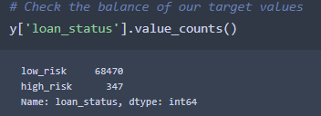
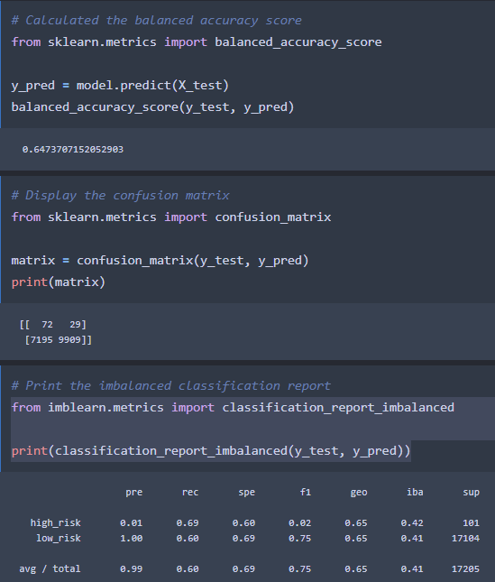
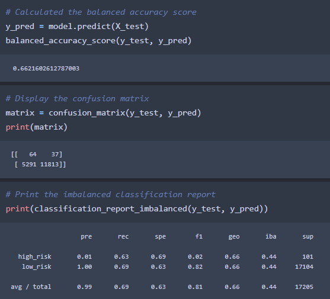
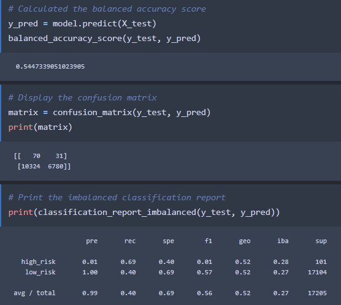
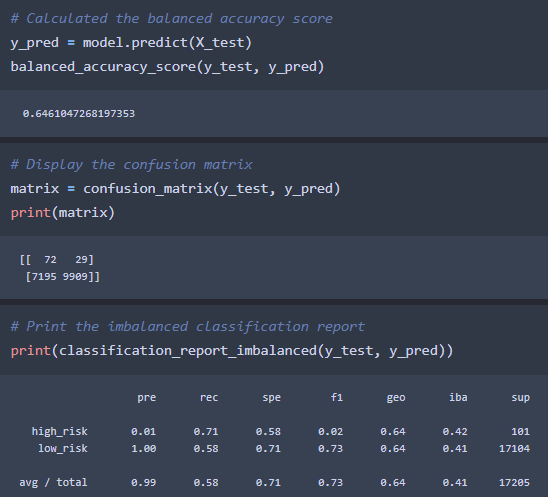
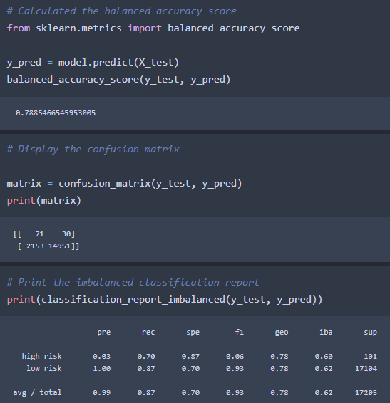
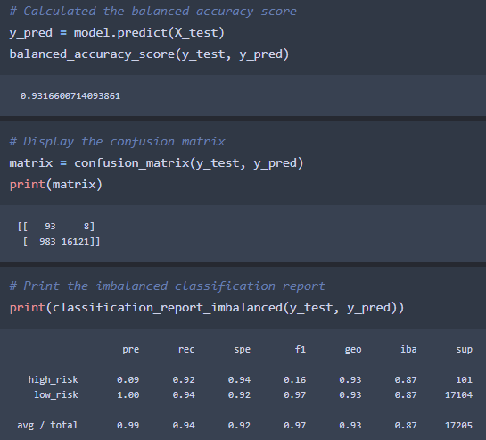

# Credit Risk Analysis

## Overview of Analysis

The purpose of this analysis was to use different machine learning models from the `scikit-learn` library to find the best one at predicting credit card risk. 

### Results

•	At first, we imported a credit card dataset from `LendingClub` using `pandas.read_csv` and transformed the data for our usage. Empty columns and rows were removed with `dropna` function, issued loans were also removed by filtering, interest rates were converted to numerical values, and the loans were classified into `low risk` and `high risk` based on their status.

•	In the next step, we assigned the X variables with the `get_dummies()` method to transform string categories into numerical values. Then we selected the `loan_status` column for our target value and counted the classes. 

•	As we can see, only 347 loans out of 68,817 are high risk, representing 0.5% of the analyzed data. 

•	We then sampled our training and testing data and proceed to fitting and testing our prediction models.

> RandomOverSampler

> SMOTE Oversampling

> ClusterCentroids Undersampling

> SMOTEENN Combination

> BalancedRandomForestClassifier

> EasyEnsembleClassifier

#### Summary
